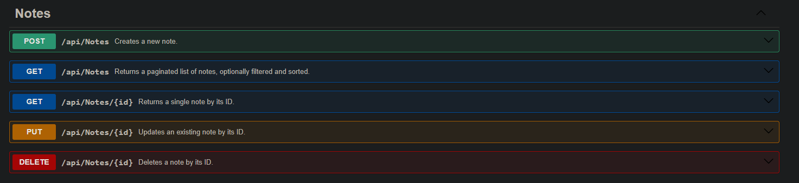

# notes-backend (.NET 8 + EF Core + SQLite)

<p align="left">
  <a href="https://github.com/rluetken-dev/notes-backend/actions/workflows/ci.yml">
    
  </a>
  
  
  
  <!-- Repo is private → static release badge for now -->
  <a href="https://github.com/rluetken-dev/notes-backend/releases">
    
  </a>
</p>

A simple, production-ready **REST API** for managing notes.  
Built with **.NET 8**, **Entity Framework Core**, and **SQLite**.  
Pairs well with the optional frontend: **[notes-frontend](https://github.com/rluetken-dev/notes-frontend)**.

---

## Table of Contents

- [Features](#features)
- [Getting Started](#getting-started)
- [Swagger Screenshot](#swagger-screenshot)
- [API Overview](#api-overview)
- [Endpoints Overview](#endpoints-overview)
- [Project Structure](#project-structure)
- [Commits & Releases](#commits--releases)
- [Development Tips](#development-tips)
- [Roadmap](#roadmap)
- [License](#license)
- [Related](#related)

---

## Features

- CRUD endpoints for notes (`GET`, `POST`, `PUT`, `DELETE`)
- Pagination, filtering (`q`), and sorting (`sort`, `dir`) for `GET /api/notes`
- Swagger UI with XML comments (`<summary/>` on controllers/models)
- EF Core with SQLite persistence (Code-First, Migrations)
- GitHub Actions CI (build + tests + lint)

---

## Getting Started

### Prerequisites
- [.NET 8 SDK](https://dotnet.microsoft.com/en-us/download)
- (optional) [SQLite CLI](https://www.sqlite.org/download.html) for inspecting the database

### Run locally
```bash
git clone https://github.com/rluetken-dev/notes-backend.git
cd notes-backend/Notes.Api
dotnet run
```

API will be available at:  
👉 `http://localhost:5000/swagger` (Swagger UI)  
👉 `http://localhost:5000/api/notes` (base endpoint)

---

## Swagger Screenshot

The interactive API documentation is available via Swagger:



---

## API Overview

### Create Note
`POST /api/notes`

```json
{
  "title": "Shopping",
  "content": "Milk, Bread, Eggs"
}
```

### Get All Notes
`GET /api/notes?q=shopping&page=1&pageSize=5&sort=title&dir=asc`

- **Query params:**
  - `q`: filter term (optional)
  - `page`: page index (default 1)
  - `pageSize`: items per page (default 10, max 100)
  - `sort`: `id | title | created | updated`
  - `dir`: `asc | desc`
- **Response header:** `X-Total-Count` = total matching notes

### Get Note by ID
`GET /api/notes/{id}`

### Update Note
`PUT /api/notes/{id}`

```json
{
  "title": "Updated shopping list",
  "content": "Milk, Bread, Eggs, Butter"
}
```

### Delete Note
`DELETE /api/notes/{id}`

---

## Endpoints Overview

| Method | Route             | Description        |
|-------:|-------------------|--------------------|
| GET    | `/api/notes`      | List all notes     |
| GET    | `/api/notes/{id}` | Get note by ID     |
| POST   | `/api/notes`      | Create a new note  |
| PUT    | `/api/notes/{id}` | Update a note      |
| DELETE | `/api/notes/{id}` | Delete a note      |

---

## Project Structure

```
notes-backend/
├─ Notes.Api/         # ASP.NET Core project (controllers, models, DI, Swagger)
├─ docs/              # Documentation assets (e.g., swagger.png)
├─ commits.md         # Conventional Commits guide (types, scopes, examples)
└─ README.md
```

---

## Commits & Releases

This repo follows **Conventional Commits** and **SemVer**.

- See **[commits.md](./commits.md)** for the rules, allowed types/scopes, and examples.
- Tag releases as `vX.Y.Z` and keep release notes concise (link the compare view).
- Repo is currently private → README uses a **static release badge**.  
  When you switch to public, you can use a dynamic one:
  ```html
  <a href="https://github.com/rluetken-dev/notes-backend/releases">
    
  </a>
  ```

---

## Development Tips

- Run `dotnet restore` after cloning to fetch dependencies.
- Keep XML doc comments tidy to enrich Swagger output.
- If you add tests, prefer `dotnet test -c Release` locally before pushing.
- If you change ports, update the URLs above (see `launchSettings.json`).

---

## Roadmap

- Authentication (JWT)
- Dockerize API
- Deploy to Azure / AWS

---

## License

MIT — feel free to use, learn, and extend.

---

## Related

- Frontend: https://github.com/rluetken-dev/notes-frontend
- Backend:  https://github.com/rluetken-dev/notes-backend
